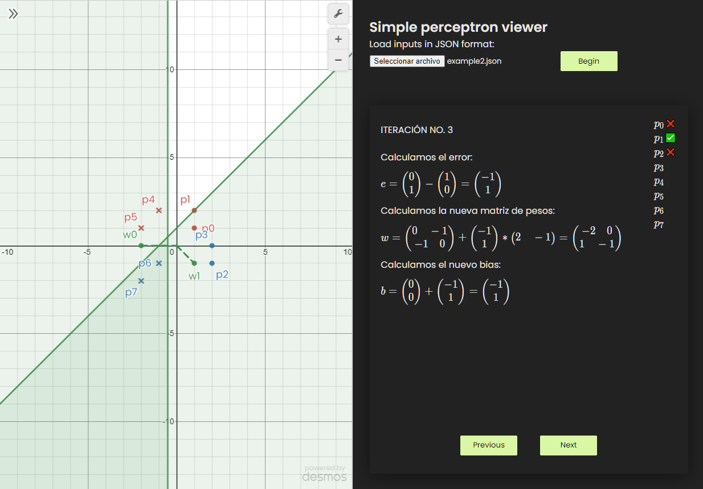

# Simple perceptron viewer

Minimal perceptron learning rules viewer.



## Characteristics

- Only supports two dimensional inputs.
- Support `n` two dimensional weight vectors (as matrix).
- Support `n` dimensional bias (as many as weight vectors).
- Support `t` dimensional targets.
- Uses [Dev Desmos API](https://www.desmos.com/api/v1.6/docs/index.html)

## Requirements

- `Nodejs` (only tested on v16.0.0) with `npm`
- Internet connection for dependencies.

## Usage (development mode)

Install dependencies:

```
npm i
```

Init webpack development server:

```
npm start
```

In the web app, select a valid json file. The are two examples in `/test` folder, which were used for classes. Then clic in `Begin` and navigate in the algorithm's steps with buttons below (`Previous` and `Next`).

## Examples

The are two examples in `/test` folder

## JSON structure:

**Note:** Comments in JSON are not allowed. Please remove them before.

```javascript
{
  // Defines the weight matrix. A single row is a vector.
  "w": [[0, 0]],
  // Vector of bias. A vector with a single value behaves like scalar.
  "b": [1],
  // Array of inputs
  "inputs": [
    {
      // Array that represents input point
      "input": [1, 1],
      // Target vector. A vector with a single value behaves like scalar.
      "target": [1]
    }
  ],
  // A DESMOS style for each target. Must match with target defined previously
  "styles": [
    {
      // Target to style
      "target": [1],
      // Point style *
      "style": "POINT",
      // Color style **
      "color": "RED"
    }
  ]
}
```

`*` Styles available are defined in [DESMOS API](https://www.desmos.com/api/v1.6/docs/index.html#document-styles)

`**` Colors available are defined in [DESMOS API](https://www.desmos.com/api/v1.6/docs/index.html#document-colors)
